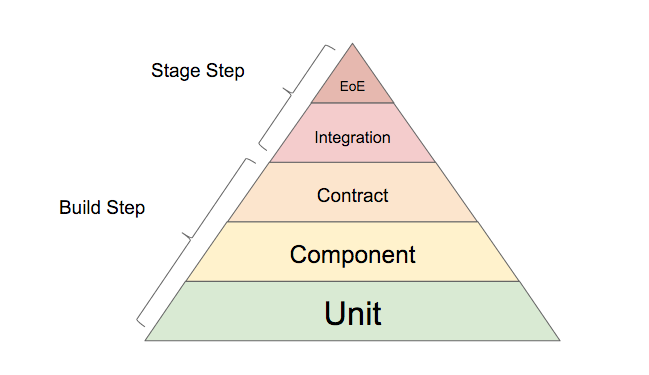

# Intro

We're going to cover two kinds of testing: unit and component

They exist in the context of the Testing Pyramid


A **Unit Test** validates a single assumption about a behavior, by isolating a unit of expected inputs and outputs (plus any side-effects). Wikipedia, if this isn't enough for ya.

A **Component Test** will also isolate inputs on a piece of code, but allow that code to run through the boundaries of the subsystem (e.g. if your subsystem uses a database, it will hit a test-localized copy of the database)

References:
http://martinfowler.com/bliki/TestPyramid.html
http://butunclebob.com/ArticleS.UncleBob.TheBowlingGameKata
http://www.scalatest.org/
http://mockito.org/

# Pre-requisites

You should have the following installed:
sbt

# Basics - Unit Testing

Let's learn some mechanics of unit testing.

All right, let's look at an example.

Our first example is the scala class that needs testing is "Basic" found at src/main/scala/com/meetup/Basic.scala

The corresponding test is in the identical package in the typical Maven folder structure for unit tests:
src/main/scala/com/meetup/BasicTest.scala
(besides being in same package, note the naming convention of the file)

The solution file is at:
src/main/scala/com/meetup/SolutionBasicTest.scala
(don't worry if your solution doesn't match exactly. did you test stuff pretty well? then, good, you rule!)

The way you run the test is like this, at the root of the project:
```
# to run this test only:
sbt test-only com.meetup.BasicTest

# to run all unit tests in this project:
sbt test
```

## First Unit Test

Look at Basic.isApple() and then in BasicTest.scala, try writing your first unit test:
* you can context by looking at: http://www.scalatest.org/user_guide/ in general, or the getting started doc
* try implementing the stuff in this block: "describe("Apple checker (basic example)") {"
* notice, you may want to create an anonymous instance of ExpensiveOrangeService. isApple() doesn't do anything with it, so just some dummy should work

## Mocks

After looking at Basic.isOrange(), in BasicTest.scala, try writing a unit test by mocking ExpensiveOrangeService, instead of creating a concrete implementaiton
* you can read http://mockito.org/, and guess how this works in scala
* you can read this sparse doc on how it works in scala: http://www.scalatest.org/user_guide/testing_with_mock_objects#mockito
* implement in this block: "describe("Orange checker (mock example)") {"

## Spies

After looking at Basic.isPear(), in BasicTest.scala, try writing a unit test by spying Basic, and mock the response of complicatedPearAlgorithm(), instead of calling the real thing
* for context you can read about it on mockito.org or google examples
* there's actually not much out there on spying in scala, so here's the TL;DR...
```scala
val spiedObject = spy(new Object)
doReturn("something").when(spiedObject).getSomethingString()
/*
Notice how the above uses the pre-pend "doReturn()", strategy instead of the post-pend "thenReturn()".
This illustrates a difference between mocks and spies.
Mocks are a totally fake object, completely proxied.
Spies are an actual object of your concrete type, but with calls intercepted (proxied too, but where the real implementation might be called if you don't specify otherwise).
That's why we don't write: when(spiedObject.getSomethingString()).thenReturn("something")
Since, by the time we've written spiedObject.getSomethingString(), we've already actually run the function!
*/
```

## Practice

For practice, and because you should create a test for it it since it's not tested above, write a test for complicatedPearAlgorithm()
* block to write this in: "describe("Complicated algorithm (package private example)") {"

## Testing a Java Class

Guess what, it's just not different. To prove it to you:
* read BasicJava.java
* copy the solution to isApple() tests from BasicTest.scala over to BasicJavaTest.scala, replace uses of "Basic" with "new BasicJava()" and confirm it still works
* do the same thing for the rest of the tests in BasicTest -> BasicJavaTest; and now implement BasicJava.java until all tests pass

# Refactoring - Unit Testing

Now let's refactor an old class into something less crappy.

1. Take a look at Crappy.java
2. Note these problems:
  1. file is 1000+ lines of code. a single method has 500+ lines of code. classic blob anti-pattern
  2. static initializer hits db to "configure" an application. 3 dumb ideas for the price of 1!
  3. nothing injected. "new" keyword makes things hard to test and ties code to a specific implementation
  4. some methods depends on object with final members, so hard to mock inputs
  5. it is not well written or really comprehensible
  6. what's worse... you've been asked to add some functionality the depends on the value of "ipsum" on L678,
    without "breaking" the code that has no javadoc, no wiki documentation, no specification,
    no understanding by the 30 people you asked, you can run the code multiple times & it is NOT deterministic,
    there are no existing tests, and oh, people think engineering has been going too
    slowly, so you need it done by EOD


Let's solve one problem at a time.

## Specification 1
Write code starting on line L678 that takes

1. null-able String value of variable "string"
2. current boolean value of static variable "c"

Then, it sets the value of "ipsum" to the value of the database-loaded value of property properties.get(the string loaded during step 1) otherwise set it to "the current timestamp is: {the current timestamp}"
OR, if "c" is false, also return the timestamp message

What is "c"? Why set "ipsum" to something? No one you ask gives you an answer that you can understand, so you really shouldn't implement this, but you're new to the job and your Lead assures you that the requirements are absolutely correct and has done the due diligence to make sure that is true. You are welcome to escalate the problem, but your company will go out-of-business tomorrow if you don't do this.

Your requirements:

1. create a method that fulfills the spec and make sure it's tested in CrappyTest.scala (see "Requirement 1")
2. get rid of that annoying database println message every time you try to test your change

## Specification 2
methodWithFinalInput whose body can absolutely not be refactored. It takes parameter CrappyInput, which is a final class.
1. Test methodWithFinalInput() without refactoring it
2. Get rid of that annoying database message, if you haven't already

## Specification 3
the body methodWithInconvienentNew contains a new statement, which has undesirable side-effects that we don't want in a testing scenario (such as hitting an API where we pay for each hit).

1. refactor methodWithInconvienentNew to confirm that command "command-to-run-important-things" gets called, without actually hitting the service class InconvenientService
